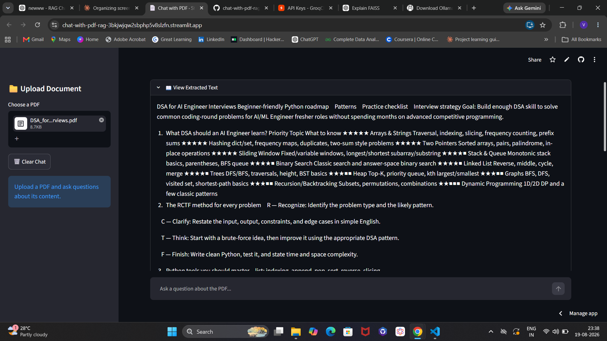
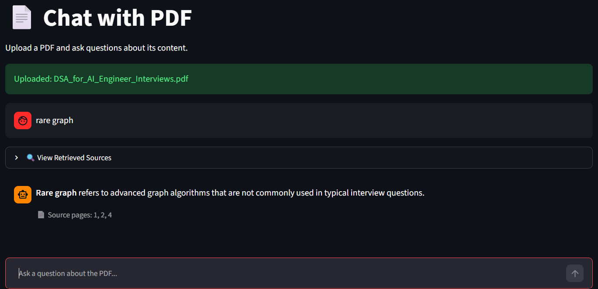

# 📄 Chat with PDF — RAG-based PDF Question Answering App

A Retrieval-Augmented Generation (RAG) application that lets you upload any PDF and ask questions about its content in natural language. The app retrieves the most relevant sections of the document and uses an LLM to generate accurate, context-grounded answers — with page-level source citations.

🔗 **Live Demo:** [chat-with-pdf-rag](https://chat-with-pdf-rag-3bkjwjqw2sbphp5v8slzfn.streamlit.app/)

---

## 🎥 Preview

| Embedding & FAISS Indexing | Deployed App |
|---|---|
|  |  |

**Source Citations**


---

## ✨ Features

- 📤 Upload any PDF and chat with its content
- 🔍 Semantic search over document chunks using FAISS
- 🧠 Context-grounded answers (no hallucination — model only answers from retrieved content)
- 📑 Page-level source citations for every answer
- 💬 Persistent chat history within a session
- ⚡ Fast inference using Groq's LLaMA 3.3 70B model
- 🗑️ One-click chat reset

---

## 🏗️ How It Works

1. **Upload** — User uploads a PDF via the sidebar
2. **Load & Split** — `PyPDFLoader` extracts text, and `RecursiveCharacterTextSplitter` breaks it into overlapping chunks (500 chars, 100 overlap)
3. **Embed** — Each chunk is converted into a vector using the `all-MiniLM-L6-v2` sentence-transformer model
4. **Index** — Vectors are stored in a FAISS (`IndexFlatL2`) index for fast similarity search
5. **Retrieve** — When a question is asked, it's embedded and the top-3 most similar chunks are retrieved
6. **Generate** — The retrieved context and question are passed to Groq's LLaMA 3.3 70B model, which answers strictly from the provided context
7. **Cite** — The app displays the answer along with the page numbers the answer was drawn from

```
PDF → Chunking → Embeddings → FAISS Index → Similarity Search → LLM (Groq) → Answer + Sources
```

---

## 🛠️ Tech Stack

| Component | Technology |
|---|---|
| Frontend / App Framework | [Streamlit](https://streamlit.io/) |
| PDF Loading | LangChain `PyPDFLoader` |
| Text Chunking | LangChain `RecursiveCharacterTextSplitter` |
| Embeddings | `sentence-transformers` (`all-MiniLM-L6-v2`) |
| Vector Store | `FAISS` |
| LLM | `Groq` — LLaMA 3.3 70B Versatile |
| Environment Management | `python-dotenv` |

---

## 📂 Project Structure

```
chat-with-pdf-rag/
├── streamlit_app.py       # Main application
├── requirements.txt       # Python dependencies
├── .gitignore
└── README.md
```

---

## 🚀 Getting Started

### 1. Clone the repository
```bash
git clone https://github.com/LAXMI15PRIYA/chat-with-pdf-rag.git
cd chat-with-pdf-rag
```

### 2. Create a virtual environment (recommended)
```bash
python -m venv venv
source venv/bin/activate      # On Windows: venv\Scripts\activate
```

### 3. Install dependencies
```bash
pip install -r requirements.txt
```

### 4. Set up your API key
Create a `.env` file in the project root and add your [Groq API key](https://console.groq.com/keys):
```
GROQ_API_KEY=your_groq_api_key_here
```

### 5. Run the app
```bash
streamlit run streamlit_app.py
```

The app will open at `http://localhost:8501`

---

## 💡 Usage

1. Upload a PDF using the sidebar file uploader
2. Wait for the document to be chunked and embedded (progress shown on screen)
3. Type your question in the chat input box
4. View the answer along with the page numbers it was sourced from
5. Expand **"🔍 View Sources"** to see the exact retrieved chunks
6. Click **"🗑️ Clear Chat"** to start a new conversation

---

## 🔮 Future Improvements

- Support for multiple PDF uploads in a single session
- Persistent vector store (currently rebuilt per session)
- Conversation memory for follow-up questions
- Support for additional document formats (DOCX, TXT)
- Streaming responses for faster perceived latency

---

## 👩‍💻 Author

**Lakshmi**
M.Tech AI & Data Science | Building AI Engineer portfolio projects
[GitHub](https://github.com/LAXMI15PRIYA)

---

## 📄 License

This project is open source and available under the [MIT License](LICENSE).

